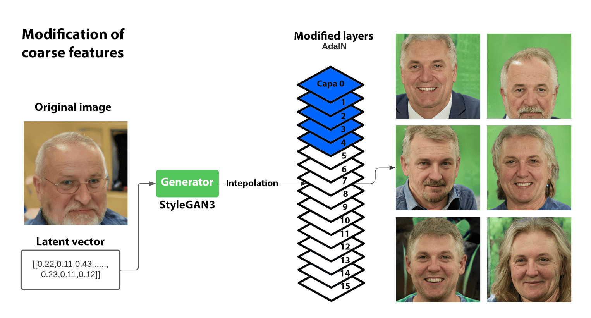
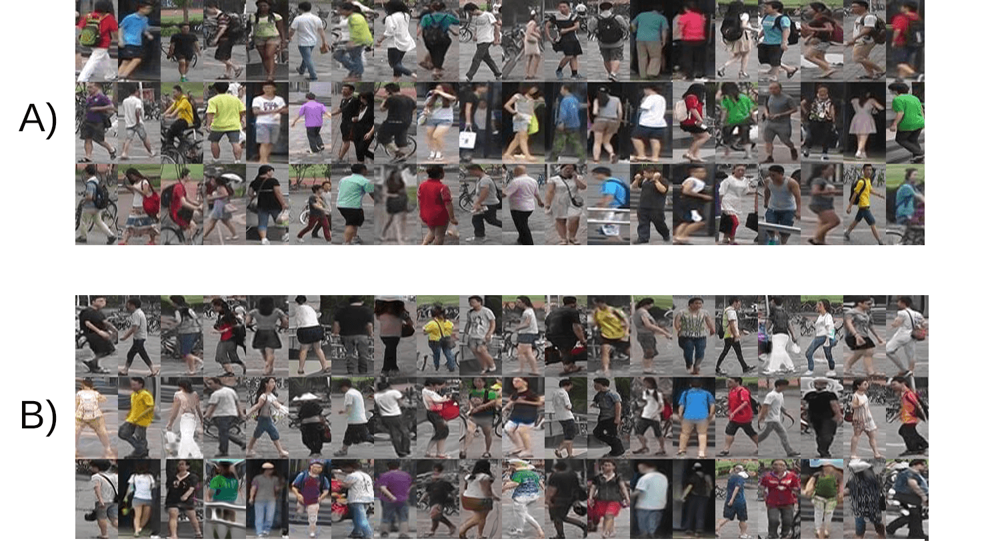
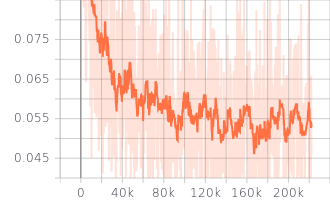
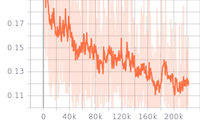
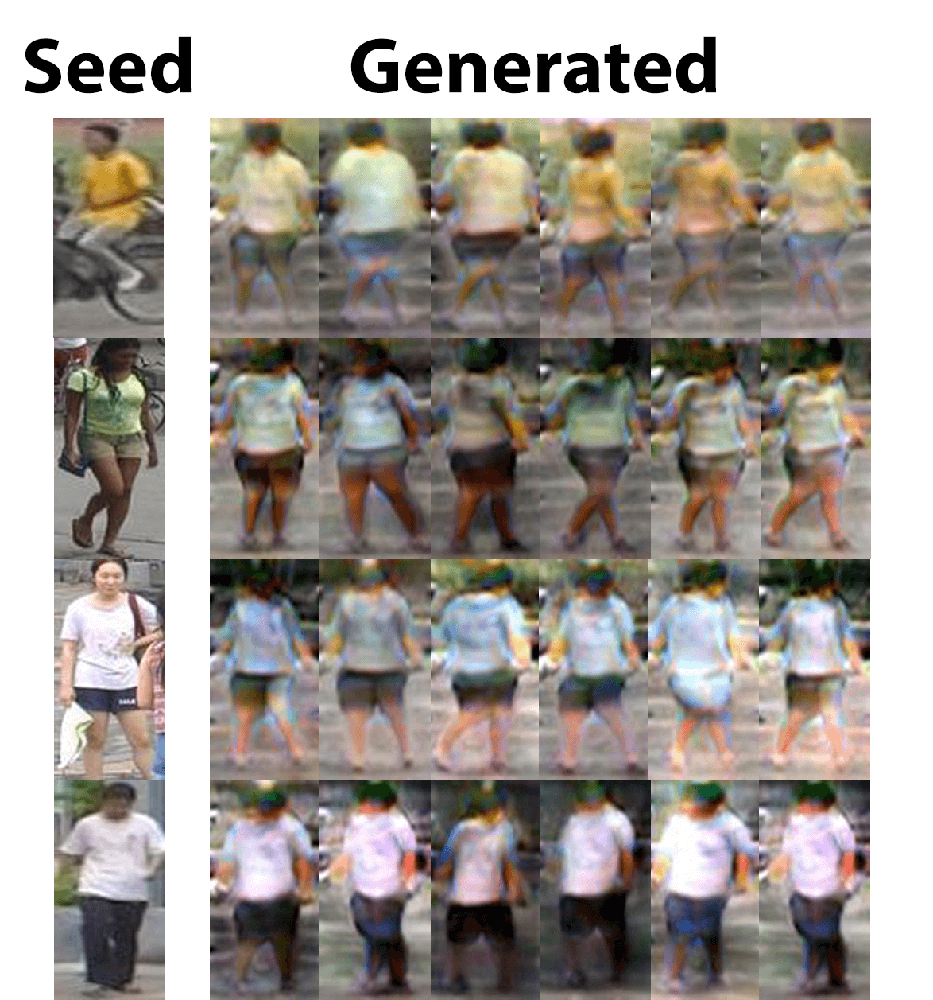
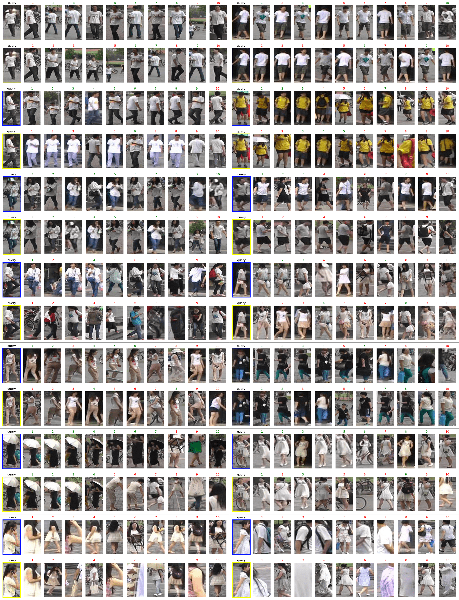
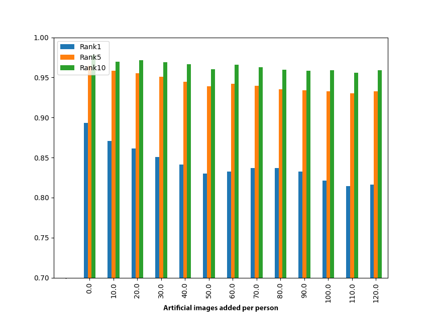

# Generation of Images using Generative Adversarial Networks for Augmentation of Training Data in Re-identification Models

This project aims to use Generative Adversarial Networks (GANs) to generate synthetic images and thus increase the quantity and diversity of training data in re-identification models.

## State-of-the-art
The study of the state of the art on the use of generative adversarial networks for data augmentation
to improve the performance of re-identification models is presented at the following 
URL: [https://uselessai.github.io/person-reidentification/](https://uselessai.github.io/person-reidentification/)

## Methodology

This chapter is an important section where the approach used to carry out the study is described in detail. The methods and techniques used to collect and analyze data, as well as the tools and platforms used, are described. Technical details about image generation and re-identification model training are explained. The proposed methodology for the development of the work has been divided into two sections. The first section will contain all the information on the training of the adversarial generative network and the generation of artificial images, while the second section will cover the training and functioning of the re-identification model. The methodology can be summarized as follows:

+ Generation of artificial images
  + Training of the StyleGAN3 adversarial generative network
  + Generation of multiple artificial images of people in different poses
  + Using a real person's image from the database as a base, generate artificial images of that same person in different poses
  + Filtering images: automatic elimination of generated images with noise or incorrect generation

+ Re-identification model
  + Design of the architecture and training of the re-identification model.
  + Execution of tests for the re-identification model.

### Generation of artificial images

For the generation of artificial images, the architecture of the Stylegan3 generative adversarial network (GAN) will be used. Stylegan3 is an image generative model developed by the Nvidia research team in 2021. It is an improved version of the Stylegan2 model and is characterized by its ability to generate high-quality and realistic images in a wide variety of content categories.

**Imagen**: Example of GAN architecture.

Stylegan3 uses a deep learning approach based on generators and discriminators. The generator is a neural network that is trained to generate images that are as realistic as possible. To do this, it is shown a set of real images and asked to generate images that resemble them. As it is trained, the generator learns to extract relevant features from real images and use them to generate images that are as realistic as possible.

The discriminator is a neural network that is trained to distinguish between real and generated images. It is shown both real and generated images and asked to determine which are real and which are generated. As it is trained, the discriminator learns to identify the features that differentiate real images from generated ones and is used to guide the training of the generator towards generating more realistic images.

Stylegan is pre-trained with 25 million face images, of which 70 thousand are real high-quality 1024 x 1024 pixel images from the FFHQ database, and the rest were generated by the Discriminator, whose architecture is more detailed in Figure 4.3.

Currently, Stylegan3 works as a high-quality face image generator. Stylegan3 has been trained to generate faces, and we will apply the transfer learning process to retrain it.

Transfer learning is a technique in which an automated learning model that has been trained to perform a specific task is used as a starting point for training another model to perform a different task. Instead of training the new model from scratch, the knowledge and skills acquired by the original model are used to initiate the training of the new model in a more advanced state.

**Imagen**: Graphical representation of a Generator. Multidimensional space where each position represents an image.

**Imagen**: Example of a 2-dimensional Generator, where each coordinate corresponds to an image. When the latent vector [0,0] is used as output, the top left image is obtained.

In this way, the time and effort required to train the new model are reduced, and its performance is improved.

For the re-training of Stylegan3, the Market-1501 database was used, consisting of 51,247 images of 1501 different people with images captured from six different cameras.

To measure the performance of Stylegan, the Fréchet inception distance (FID) metric was used, proposed by P. Dimitrakopoulos et al., 2017. FID is a distance metric between two distributions of images that is used to measure their similarity. The FID metric is based on the idea that the distance between two distributions of images is the same as the distance between the features of the images extracted from a deep neural network. Therefore, to calculate the FID distance between two distributions of images, the features of each distribution are first extracted using a deep neural network, and then the distance between those features is calculated using the Fréchet distance.

For the generation of variations in the original images, a peculiarity of Stylegan3 was used. During the experiments, the Stylegan team tried to modify the latent vector at each AdaIN layer, and as a result, the image showed different changes from the original. For example, starting from a latent vector of a person's face, if the latent vectors of the first AdaIN layers were modified, they noticed that the "coarse" features of the image changed, followed by the "middle" features and finally the "fine" features. In figures 3.7, 3.8, and 3.9, several real examples can be seen by modifying the latent vector at different layers of AdaIN.

1. Coarse features: These are the features where the structure of the image, in this case, the face, is modified, generating completely different people.
2. Middle features: The structure of the image is the same as the original except for the pose modification.
3. Fine features: Both the structure and pose are the same, but things like skin color, hair, eyes, etc. are modified.
The premise of this research was derived from the above. If it is capable of generating variations in people's faces by modifying the latent vectors at each layer, will it be able to generate images of people in different poses?

**Imagen**: The latent vector is modified in the last layers of AdaIN. Changes can be observed in the fine characteristics, such as hair color, eye color, and skin tone, while the structure and posture of the face remain the same.

**Imagen**: The latent vector is modified in the middle and last layers of AdaIN. Changes can be observed in the middle and fine features. The structure of the face is modified while the pose remains the same.

**Imagen**: The latent vector is modified in the early layers of AdaIN. Changes in strong features, such as the structure of the image, can be observed, while the hair or skin color remains the same..

Two methods were implemented to generate images, the first one is completely random, creating artificial people, and the second is by using a real image of a person and generating variations from it.

+ Generation of artificial person images.
Through a random number, also known as a seed, the Generator assigns a latent vector that corresponds to an image. Once the original image is obtained, variations can be generated by using another random latent vector through another seed or by interpolations. The latent vector is modified in different AdaIN layers of the model, also called style mixing, to obtain different variations of the original image. These variations can range from a total change in the structure of the image to more subtle changes such as changes in tone, lighting, colors, saturation, etc.
Another way to generate variations of the original image is by modifying the original latent vector through interpolations, latent vectors are mixed to obtain variations of the original image.

+ Generation of artificial images of real people.
As explained earlier, a model, an encoder, needs to be trained to obtain the latent vector of a real image. In this case, the stylegan3-editing model was used and trained on the PsP encoder developed by Richardson et al. The encoder is part of a neural network that processes input information and converts it into an internal representation that can be used by Stylegan3 to generate the version of the real image within the latent space.
The LPIPS metric, Learned Perceptual Image Patch Similarity, is used as the loss function to compare the real image with the one obtained in the generator.

Once the images have been generated, it is necessary to automate their filtering. It may happen that images with noise or distortion have been generated.

To measure and discard the images generated by the generative adversarial network, metrics based on the quality of the generated data have been used

After generating the images, it is necessary to automate their filtering. It is possible that images with noise or distortion have been generated. To measure and discard the images generated by the adversarial generative network, metrics based on the quality of the generated data have been used.

The first filter applied is a model for pedestrian detection, and the structural similarity index measure (SSIM) has been used to measure the similarity of the generated images.

+ YoloV4 tiny filtering

YOLOv4 tiny is a reduced version of the YOLOv4 model, which is used to detect objects in images and videos. YOLO (You Only Look Once) is an object detection approach characterized by its speed and accuracy. The tiny version of YOLOv4 is especially useful for low-power devices, as it is less demanding in terms of resources and can be efficiently executed on mobile devices and low-performance computers.

In general terms, YOLOv4 tiny uses a convolutional neural network to extract features from an image and then uses a combination of machine learning techniques to perform object detection. The tiny version of YOLOv4 has been optimized to detect pedestrians with comparable precision and speed to larger models but with less resource demand. This makes it an excellent option for real-time applications on devices with limited capabilities.

+ SSIM Filtering

The Structural SIMilarity (SSIM) metric is a measure of structural similarity between two images. SSIM is often used to evaluate the quality of a processed image compared to an original image, and it is calculated by comparing the structural features of both images.

SSIM is based on the fact that human perception of image quality is based on its structural content, and not just the pixel difference between two images. Therefore, SSIM is used to measure the structural similarity between two images and give a score that reflects the perceived quality by a human observer.

### Re-identification model

A re-identification model is an algorithm used in image processing and artificial intelligence that allows for the identification and tracking of objects or people in a sequence of images. These models are based on the comparison of visual features between different images to determine if they correspond to the same object or person.

Mathematically, a re-identification model uses a similarity function to calculate the similarity between two images. This function takes two vectors of visual features (one from the reference image and the other from the image to be compared) and returns a value that indicates the similarity between the two images. If the value returned by the similarity function exceeds a certain threshold, it is determined that the images correspond to the same object or person.

To calculate the vectors of visual features, the model uses a neural network that has been previously trained with a set of labeled image data. The neural network extracts relevant features from the images and groups them into a feature vector. These vectors are then used in the similarity function to determine the similarity between the images.

The architecture proposed for the re-identification model uses a Resnet50 convolutional neural network where the last layer is modified so that the output depends on the number of people the model will be trained with. Cross entropy loss was used as the loss function during training.

A re-identification model is an algorithm used in image processing and artificial intelligence to identify and track objects or people in a sequence of images. These models are based on comparing visual features between different images to determine if they represent the same object or person.

Mathematically, a re-identification model uses a similarity function to calculate the similarity between two images. This function takes two vectors of visual features (one from the reference image and the other from the comparison image) and returns a value that indicates the similarity between the two images. If the value returned by the similarity function exceeds a certain threshold, it is determined that the images correspond to the same object or person.

To calculate the vectors of visual features, the model uses a neural network that has been previously trained with a set of labeled images. The neural network extracts relevant features from the images and groups them into a feature vector. These vectors are then used in the similarity function to determine the similarity between the images.

Once training is completed, the model functions as a feature extractor. The next step is image classification. Each image to be evaluated is introduced into the model to obtain its respective feature vectors. To classify which images belong to the same person, each of the vectors of the images is compared with the vector of the original image using cosine distance.

Cosine distance is a measure of similarity between two vectors in a vector space. This measure is calculated using the cosine of the angle between the two vectors and can be interpreted as the projection of the shorter vector onto the longer vector.

After obtaining the cosine distance of all the images, they are sorted and the ones with the smallest cosine distance will be the ones that are closest to the original image, meaning that they have been detected as images of the same person.

### System architecture

## Experimental Results

### Generation of artificial images

The generative adversarial network StyleGAN3 was used to generate artificial images. StyleGAN3 was pre-trained with 25 million face images, 70 thousand of which were real high-resolution 512 × 512 pixel images from the Flickr-Faces-HQ Dataset (FFHQ), and the rest were generated by the discriminator.

The next table shows the training characteristics of StyleGAN3.

| **cfg** | **gpus** | **batch** | **gamma** | **kimg** | **snap** | **metrics** |  
|---------|----------|-----------|-----------|----------|----------|-------------|
| stylegan3-r | 1 | 16 | 2 | 5000 | 20 | fid50k_full |

*Table: Hyperparameters used during the training of Stylegan3. The parameter cfg (stylegan3-r) is used to determine the type of training config R or rotation equivalent, which prevents the deterioration of the FID metric measurement if the generated images are rotated or moved. It was trained on a GPU. batch (16) is the number of images that are fed into the network at each training iteration. gamma (2) is the R1 regularization weight, which indicates how fast the weights are updated. kimg (5000) is the total duration of the training. snap (20) indicates how often the model is saved, in this case, every 80,000 images. metrics (fid50k_full) is the metric used to measure the performance of the model during training.*

Transfer learning was performed, and it was re-trained with 51,247 images from the Market-1501 database. The hyperparameters used, and training performance was measured using the Fréchet Inception Distance (FID) metric. This metric is applied to both the generated and real images, and the more similar the values of both are, the better the image generation. The performance of StyleGAN3 is much better than that of other generative adversarial networks trained with the same database. 

| Model | Training Images | Test Images | Training Duration | Hardware |
|--------|--------------------|--------------|---------------|----------|
| Stylegan3 | 51247 | Not applicable | 2d 08h 24m | Titan RTX |

*Table: Technical data for Stylegan3 training for the generation of artificial images. Model, number of images used for training, training duration, and graphics card used.*

**IMAGE**: The evolution of the model's performance through the FID metric at different epochs of Stylegan3 training.

**IMAGE**: Quality of the StyleGAN3 model to generate artificial images compared to real ones.

## Table

| Characteristics | AdaIN Layers | Example |
| --- | --- | --- |
| Fine | (12,13,14,15) |  |
| Medium | (5,6,7,8,9,10,11) |  |
| Coarse | (0,1,2,3,4,5) |  |

*Table. Layers used to generate new images of the same person depending on the modification of their fine, medium, or coarse features.*

## Material

- [Stylegan3 project](https://github.com/NVlabs/stylegan3)
- [Stylegan3 Model trained with Market-1501 database](https://drive.google.com/file/d/1Ep-CfJBAcOF6dm7EXBjRkRIW_r7_Xyk-/view?usp=share_link)
- **Parameters**: python train.py --outdir=~/training-runs/2022 --cfg=stylegan3-r --data=./datasets/market_FULL50KIMGs.zip --gpus=1 --batch=16 --gamma=2  --kimg=5000 --snap=20 --metrics=fid50k_full --resume=https://api.ngc.nvidia.com/v2/models/nvidia/research/stylegan3/versions/1/files/stylegan3-r-afhqv2-512x512.pkl

### Filtering images

After the artificial images were generated, two filters were applied to discard images that may have been generated incorrectly or contain noise.

+ YoloV4 tiny Filtering

The trained YoloV4 tiny model was used to detect pedestrians, and all generated images with a value below the threshold of 0.6 were discarded. This value was determined through analysis of Fig. 5.3, which shows the different percentages of images classified as non-pedestrians using different threshold values on real images from the Market-1501 database. When a threshold of 0.6 is used, the percentage of misclassified images as non-pedestrians is only 6.45%, making it a conservative value to use in filtering artificially generated images.

+ SSIM Filtering

The Structural SIMilarity (SSIM) metric was used to measure the similarity between two images. The methodology for applying this metric is as follows: one image of a person is chosen and compared to the rest of the images of that same person in different postures. If the value is equal to one, it means it is the same image. It was applied to the real images of the Market-1501 database, and the histogram was obtained. Using this histogram, images with an SSIM value lower than 0.75 were discarded.

## Results

| Method | Market-1501 FID | Ref |
| --- | --- | --- |
| **Real** | **7.22** | Hao Chen *et al.* |
| IS-GAN | 281.63 | Hao Chen *et al.* |
| FD-GAN | 257.00 | Saleh Hussin *et al.* |
| PG-GAN | 151.16 | Zhedong Zheng *et al.* |
| DCGAN | 136.26 | Saleh Hussin *et al.* |
| LSGAN | 136.26 | Zhedong Zheng *et al.* |
| PN-GAN | 54.23 | Zhedong Zheng *et al.* |
| GCL | 53.07 | Hao Chen *et al.* |
| DG-Net | 18.24 | Hao Chen *et al.* |
| DG-GAN | 18.24 | Saleh Hussin *et al.* |
| **StyleGAN3** | **9.29** | |

*Table: Comparative table of different adversarial generative networks, using the FID metric and training all models with the Market-1501 dataset. The first row is the value obtained when applying the metric to real images in the dataset.*

**IMAGE**: A) Real images from the Market-1501 database. B) Artificial images.

## Material

- [YoloV4 tiny - Tutorial](https://data-flair.training/blogs/pedestrian-detection-python-opencv/)
- [YoloV4 tiny - Code](./pedestrian_detector/)
- [SSIM Filtering](./similitudSSIM.py)

### Generation of artificial people

During the experimentation, 401 artificial person images were randomly generated, and 51 images per person were generated by modifying their latent vectors in different postures, resulting in a total of 20,451 images (see Fig. 5.6). The Yolo V4 filter was applied to the generated images to detect pedestrians, and 3,419 images representing 16.7% of the total were eliminated. Different examples of filtered images are shown in image below. The SSIM filter was then applied, and 386 images, representing 2.3% of the total, were discarded.  Once the filters were applied, a total of 3,815 images were discarded.

| Method                                            | Discarded images | %   |
| -------------------------------------------------- | ---------------- | --- |
| Yolov4-tiny pedestrian detection (Jiang et al.,2020)| 3,419            | 16.7|
| SSIM (Wang et al., 2004)                           | 396              | 2.3 |
| **TOTAL**                                         | **3,815**        | **18.6** |

*Tabla: Number of discarded images during the application of different filters.*

**IMAGE**: Seed - the randomly generated image that will have its latent vectors modified to alter its medium features. Generated - the images that have been created by modifying the latent vectors of the seed image.

**IMAGE**: Example of some discarded images using the Yolo V4 tiny model for pedestrian detection.

**IMAGE**: Example of some discarded images using the SSIM metric. Starting with one of the images of a person (original image), it is compared to the rest of the generated images of that same person.

## Material

- [Images of 432 artificial persons.](https://drive.google.com/file/d/1M1IcjEs5V8wjyPWAuKXQjUuZq8SUxJWi/view?usp=share_link)

### Generation of artificial images of real people.

To generate images of a real person, the stylegan3-editing model had to be trained for 240,000 epochs. To measure the model's performance during training, three different loss functions were used: Perceptual Similarity Metric (LPIPS), L2, and Momentum Contrast (MOCO) (60-62). Table 5.7 shows how the loss functions fluctuate during different epochs. This could be due to the fact that this architecture is designed to work with simpler databases, such as faces, where the images are not as complex as a full-body image of a person in different poses.

Using the model generated at epoch 220,000, the latent vectors representing the input images were obtained. As shown in Figure 5.16, the resulting images are visually similar but do not reach the quality of the images generated in the previous stage.

| Model             | Training img. | Validation Imgs.  | Training | Epochs   | Hardware |
| ------------------ | ----------------- | -------------- | ------------- | -------- | -------- |
| stylegan3-editing  | 39466             | 732            | 3d 03h 16m    | 240.000  | Titan RTX|

**Table**: Technical data of the training of the model for artificial image generation.

To measure the performance of the model during training, three different loss functions were used: Perceptual Similarity Metric (LPIPS), L2, and Momentum Contrast(MOCO). During the training he loss functions fluctuate in different epochs. This may be due to the fact that this architecture is designed to work with simpler databases, such as faces, where images are not as complex as a full body of a person in different poses.

The next thing to observe is that the learning is smoother and it can be seen that the LPIPS metric is the one that improves more steadily.

## Table

|  |  |
| :---: | :---: |
| Figure 1. LPIPS | Figure 2. L2 |

|  |
| :---: |
| Figure 3. MOCO |

*Table. Evolution of the loss functions during training up to epoch 220,000.*

Using the model generated in epoch 220,000, latent vectors representing the input images were obtained. The resulting images resemble the target images, but the quality is not as high as the images generated in the previous step.

**IMAGE**: The real image is on the right, and its counterpart obtained through the encoder within the latent space of StyleGAN3 is on the left. It can be observed that the model performs better when the full body is shown, but it does not reach the quality of images generated randomly.

After generating the latent vector, variants of that person in different poses were generated by modifying the latent vectors. A total of 75,788 images of 751 different people were generated. After applying various filters, 63,659 images remained.

| Método                                       | Imgs. descartadas |   %   |
|----------------------------------------------|------------------|-------|
| Yolov4-tiny pedestrian detection (Jiang, 2020) | 12,129           | 16.0% |
| SSIM (Wang, 2004)                             | 1,108            | 1.46% |
| **TOTAL**                                    | **13,237**       | **17.46%** |

*Table: Number of discarded images during the application of different filters.*

**IMAGE**: Seed - real image. Generated - the images that have been generated by modifying the latent vectors of the seed image..

## Material

- [Stylegan3 decoder](https://github.com/yuval-alaluf/stylegan3-editing)

- Training code. python ./inversion/scripts/train_restyle_psp.py --dataset_type market_encode  --encoder_type ResNetBackboneEncoder  --exp_dir experiments/restyle_psp_ffhq_encode_market  --batch_size 2  --test_batch_size 2  --workers 8  --test_workers 8  --val_interval 5000  --save_interval 10000  --start_from_latent_avg True  --lpips_lambda 0.8  --l2_lambda 1  --id_lambda 0.1  --input_nc 6  --n_iters_per_batch 3  --output_size 64  --stylegan_weights ./network-snapshot-002160Stylegan3.pt
- [Stylegan3 decoder model](https://drive.google.com/file/d/1jEdVOdGpz08WEkck38T-_I3QsC3lsaBq/view?usp=share_link)
- [Artificial images of real people.](https://drive.google.com/file/d/17ALVdrY6vaOX2KvjgtYutoduR2Mvx4Ka/view?usp=share_link)
- Google colab
  * https://colab.research.google.com/drive/18_t0YdYi_QtL1iZjgwD_XjWRt_2TyMzA?authuser=1
  * Convert PKL Stylegan3 to PT compatible with Stylegan3 decoder
  * https://colab.research.google.com/drive/1vPF7zz8Rsc6D8_TBUFDRxsslHagebmr9?authuser=1

## Re-identification

Two types of experiments were conducted during the experimentation based on the type of artificial images generated. First, the performance of the model was analyzed when artificial images of people and their variants in different postures were added, and then with artificial images generated from real person images. For training, a batch size of 16 images was used as a hyperparameter, and only one GPU was used. In all the different experiments, the algorithm was trained for 60 epochs.

## Material

- [Re-identification model baseline.](https://github.com/layumi/Person_reID_baseline_pytorch)
- [Re-identification model modification.](./model.py)

### Using 320 artificially generated people

During the experimentation, the model was tested with different numbers of added individuals, increasing in increments of ten up to three hundred and twenty. In Fig. 5.21, it can be seen that the performance of the base re-identification model remains stable or even decreases slightly, and then begins to improve. This could be because increasing the number of individuals also increases the number of classes, and since they have a different number of images, some classes may be less relevant than others, and adding more individuals may only introduce a small amount of noise. Adding 280 individuals during training led to a 1% improvement.

During training, it can be observed that the model stabilizes from epoch 40 onwards, and this behavior is consistent across all experiments. There is no significant change in performance with respect to the number of added individuals.

## Table

|  |
|:--:|
| Base, without added persons. **Left**, loss function during training and validation. **Right**, Rank1 error percentage during training and validation.|

|    |
|:--:|
| Adding 100 people. **Left**, loss function during training and validation. **Right**, Rank1 error percentage during training and validation.. |

| Pers. | Img.   | Rank                                        |
|-------|--------|---------------------------------------------|
| 0     | 0      | Rank@1:0.893112 Rank@5:0.964964 Rank@10:0.977732 mAP:0.742632 |
| 10    | 473    | Rank@1:0.888955 Rank@5:0.964074 Rank@10:0.980404 mAP:0.743795 |
| 20    | 874    | Rank@1:0.892221 Rank@5:0.961105 Rank@10:0.974169 mAP:0.745116 |
| 30    | 1252   | Rank@1:0.891627 Rank@5:0.965558 Rank@10:0.979513 mAP:0.741414 |
| 40    | 1.682  | Rank@1:0.890143 Rank@5:0.964371 Rank@10:0.979513 mAP:0.748799 |
| 50    | 2.046  | Rank@1:0.894299 Rank@5:0.962589 Rank@10:0.978028 mAP:0.746853 |
| 60    | 2.427  | Rank@1:0.901128 Rank@5:0.967637 Rank@10:0.980404 mAP:0.751229 |
| 70    | 2.859  | Rank@1:0.892815 Rank@5:0.965261 Rank@10:0.978325 mAP:0.748843 |
| 80    | 3.214  | Rank@1:0.892518 Rank@5:0.965261 Rank@10:0.977732 mAP:0.748257 |
| 90    | 3647   | Rank@1:0.899347 Rank@5:0.964964 Rank@10:0.979216 mAP:0.758927 |
| 100   | 4058   | Rank@1:0.898159 Rank@5:0.964667 Rank@10:0.980998 mAP:0.755366 |
| 150   | 6.167  | Rank@1:0.898753 Rank@5:0.965261 Rank@10:0.979513 mAP:0.761433 |
| 200   | 8.223  | Rank@1:0.896378 Rank@5:0.967340 Rank@10:0.980701 mAP:0.763768 |
| 250   | 10.307 | Rank@1:0.893705 Rank@5:0.964964 Rank@10:0.980107 mAP:0.762484 |
| 280   | 11.244 | Rank@1:0.903504 Rank@5:0.966746 Rank@10:0.982185 mAP:0.767955 |
| 300   | 12.320 | Rank@1:0.896081 Rank@5:0.963777 Rank@10:0.978919 mAP:0.768727 |
| 320   | 14.371 | Rank@1:0.896675 Rank@5:0.965855 Rank@10:0.978622 mAP:0.769509 |

*Table: Training results with different number of added people. The first row is the base, without adding any images.*

**IMAGE**: Performance of some models trained with different numbers of artificially generated people. Adding 0, 40, 80, 120, 160, 200, 240, 280, and 320 people.

**IMAGE**: Results of the re-identification model. Comparison of results with the base model and the model after adding 280 people. Query is the image of the person being searched for, and the following images represent the output of the model, with green indicating a correct match and red indicating an error.

## Material

- [Re-identification model baseline.](https://drive.google.com/drive/folders/1rDxHSBYuDcokv90dMtLe_--OpycOAtaZ?usp=share_link)

### Adding more images of each real person in different poses.

During the experimentation, we tested adding more images to each person in the training set, with increments of five in each test. The performance of the base re-identification model deteriorates as we add more images, with a decrease of 8% in performance when adding 100 images per person. This is due to the poor quality of the generated images, which are much more diffuse than the real training images.

Similarly to the previous section, during training it can be observed that the model stabilizes after epoch 40, regardless of the number of added images per person, with no significant change in performance.

## Table

|  |
|:--:|
| Base, without added persons. **Left**, loss function during training and validation. **Right**, Rank1 error percentage during training and validation.|

|    |
|:--:|
| Adding 100 people. **Left**, loss function during training and validation. **Right**, Rank1 error percentage during training and validation.. |

| Ppl. | Img. | Rank                                                |
|-------|------|-----------------------------------------------------|
| 0     | 0    | Rank@1:0.893112 Rank@5:0.964964 Rank@10:0.977732 mAP:0.742632 |
| 751   | 5    | Rank@1:0.886876 Rank@5:0.959620 Rank@10:0.975950 mAP:0.719692 |
| 751   | 10   | Rank@1:0.878860 Rank@5:0.958432 Rank@10:0.977138 mAP:0.704901 |
| 751   | 15   | Rank@1:0.870546 Rank@5:0.958729 Rank@10:0.969715 mAP:0.686172 |
| 751   | 20   | Rank@1:0.865796 Rank@5:0.950119 Rank@10:0.972981 mAP:0.674047 |
| 751   | 25   | Rank@1:0.861342 Rank@5:0.955166 Rank@10:0.971793 mAP:0.663773 |
| 751   | 30   | Rank@1:0.850950 Rank@5:0.951010 Rank@10:0.969121 mAP:0.654492 |
| 751   | 35   | Rank@1:0.845606 Rank@5:0.940915 Rank@10:0.964074 mAP:0.635790 |
| 751   | 40   | Rank@1:0.841449 Rank@5:0.944477 Rank@10:0.966746 mAP:0.640035 |
| 751   | 45   | Rank@1:0.826306 Rank@5:0.935273 Rank@10:0.961105 mAP:0.630469 |
| 751   | 60   | Rank@1:0.829869 Rank@5:0.938836 Rank@10:0.960214 mAP:0.624382 |
| 751   | 70   | Rank@1:0.832245 Rank@5:0.942102 Rank@10:0.965855 mAP:0.623470 |
| 751   | 85   | Rank@1:0.825713 Rank@5:0.935570 Rank@10:0.959620 mAP:0.614014 |
| 751   | 105  | Rank@1:0.817399 Rank@5:0.932304 Rank@10:0.958729 mAP:0.605653 |
| 751   | 135  | Rank@1:0.813539 Rank@5:0.931710 Rank@10:0.958135 mAP:0.601084 |

*Table: Training results by adding a different number of individuals. The first row represents the baseline, without adding any image.*

**IMAGE**: Performance of some models trained with different numbers of artificial images per person. Adding 0, 10, 20, 30, 40, 50, 60, 70, 80, 90, 100, 110, and 120 images per person.

## Conclusions

The use of generative adversarial networks to augment data is a promising technique to improve the performance of re-identification models. The results obtained in our experiment demonstrate that this technique is effective in generating high-quality data and the versatility to generate modifications of the same.
As a result of the experimentation, it was observed that by adding totally artificial people, the re-identification model was able to improve its performance by 1%. The same could not be achieved by increasing images of existing people because the encoder could not obtain latent vectors similar to real images. This may be due to the fact that these tools are prepared to work with faces, not with images as complex as a whole body.
The use of these generative adversarial networks allows for the utilization of fewer original data in training, which can reduce the requirements for resources and time in the model training process. In summary, the use of generative adversarial networks in the field of re-identification is a valuable technique that can provide a significant improvement in the performance of re-identification models.
Generative adversarial networks allow for adaptation to different data sets and situations. This makes it a valuable tool not only for the field of re-identification, but also for other fields where data generation and improvement are required
  
  
## Acknowledgments

I would like to express my sincere gratitude to the University Autónoma de Yucatán for providing me with the opportunity to pursue my graduate studies and complete this thesis. I am grateful to the faculty members who taught and guided me throughout my academic journey, especially my thesis advisor, Víctor Uc Cetina and Anabel Alonso for providing me with invaluable insights and advice.

I would also like to thank Francisco Javier Hernández López for his generous support and for facilitating the use of the servers at CIMAT, the Center for Research in Mathematics, which made my experimentation possible. Without his help, it would have been impossible to carry out this research.

For the translation of the texts from the original Spanish to English, the generative model ChatGPT has been used.

## License

This project is licensed under the MIT License - see the [LICENSE](LICENSE) file for details.
